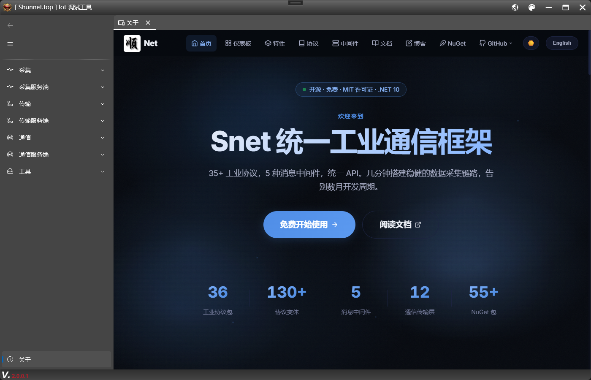
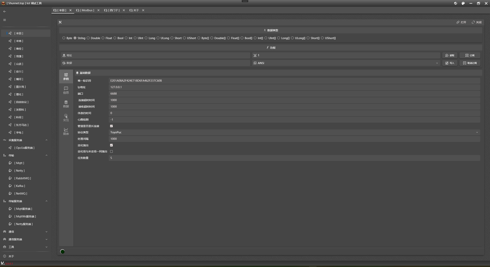
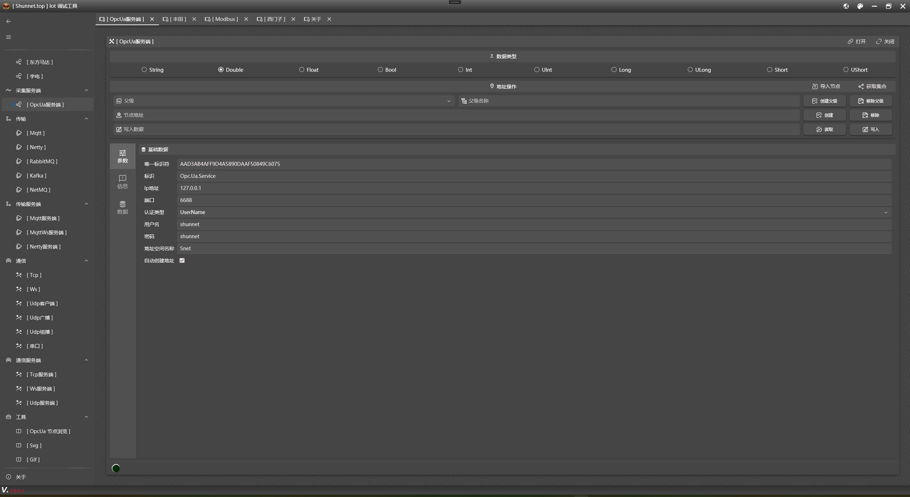
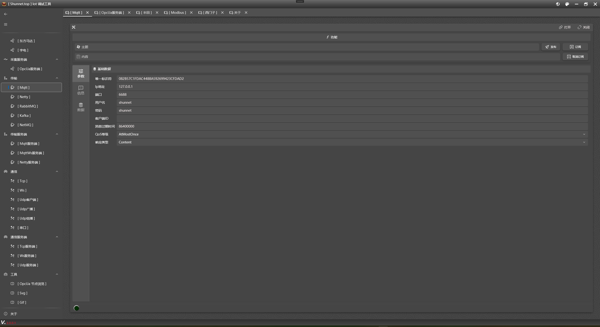
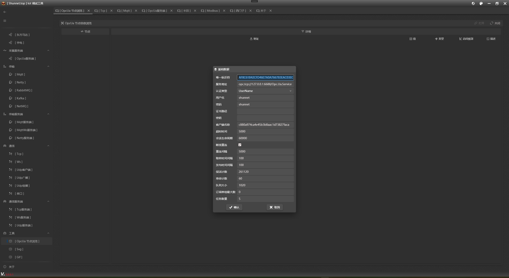
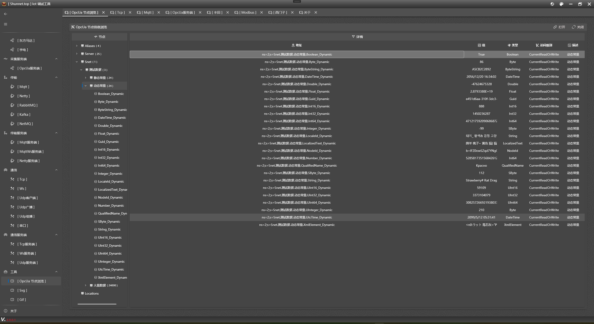

<h1 align="center">🔧 Snet.Iot.Debug</h1>

<p align="center">
  
</p>

<p align="center">
  <b>开源 · 免费 · 多协议 · 工业物联网调试诊断工具</b>
</p>

<p align="center">
  
  
  
  
</p>

<p align="center">
  🏭 基于 Snet 工业通信库的多协议调试与诊断工具<br/>
  支持 40+ 工业协议 · 通信调试 · OPC UA 节点浏览 · 实时图表 · SVG/GIF 工具
</p>

<p align="center">
  <a href="https://shunnet.top"><b>🌐 官方网站</b></a> ·
  <a href="https://github.com/shunnet/Debug"><b>📦 GitHub</b></a> ·
  <a href="https://github.com/shunnet/Debug/releases"><b>📥 下载</b></a>
  <a href="https://github.com/shunnet/Daq"><b>🛠️ 数采工具</b></a> ·
</p>


## ✨ 项目介绍

**Snet.Iot.Debug** 是基于 **Shunnet.top 工业通信库（Snet.Core）** 开发的多协议调试诊断工具，专为工业设备通信调试与协议测试场景设计。与数采工具 [Snet.Iot.Daq](https://github.com/shunnet/Daq) 互补，Debug 聚焦于**单设备/单协议的交互式调试**。

### 🏗️ 项目架构

```
┌──────────────────────────────────────────┐
│   Snet.Iot.Debug (WPF 桌面应用)            │  ← UI 层：MVVM + Material Design + WPF UI
├──────────────────────────────────────────┤
│   Snet.Core / Snet.Windows.Controls       │  ← 框架层：MVVM 基类 / 控件 / 依赖注入
├──────────────────────────────────────────┤
│   Shunnet.top 工业通信库 (40+ 协议驱动)     │  ← 协议层：DAQ / MQ / 通信 / OPC UA
└──────────────────────────────────────────┘
```

### 🛠️ 技术栈

| 分类 | 技术 / 库 |
|------|-----------|
| 🖼️ **UI 框架** | WPF + MVVM (CommunityToolkit.Mvvm) + Material Design In XAML + WPF UI (lepo.co) |
| 📡 **工业协议** | Snet 通信库 — 40+ PLC/协议驱动，OPC UA Client/Server，MQTT Client/Broker |
| 📊 **图表可视化** | ScottPlot 5.x（多曲线实时图表、十字准线、皮肤切换、图例交互） |
| 🎬 **媒体处理** | FFmpeg（视频转 GIF）|
| 🎨 **SVG 转换** | SvgHandler（SVG Path → WPF XAML 转换） |
| 🌐 **多语言** | ResX 资源文件本地化（中文 / English） |
| 🔧 **DI 容器** | Microsoft.Extensions.DependencyInjection |
| 📝 **日志编辑器** | AvalonEdit（语法高亮、日志着色） |

### 📋 功能矩阵

| 模块 | 说明 |
|------|------|
| 🔌 **DAQ 协议调试** | 40+ 工业协议驱动，支持读写/订阅/数据类型切换/编码格式配置 |
| 📨 **MQ 客户端调试** | MQTT / Netty / RabbitMQ / Kafka / NetMQ 发布订阅调试 |
| 🖥️ **MQ 服务端调试** | MQTT Broker / MQTT WebSocket / Netty Service 服务端管理 |
| 📡 **OPC UA 服务端** | 内置 OPC UA Server，支持节点增删/文件夹管理/导入导出 |
| 🌳 **OPC UA 节点浏览** | 树形节点浏览器，分页加载，节点属性详情，批量订阅/导出 |
| 🔗 **通信调试** | TCP / WebSocket / UDP(单播/广播/组播) / 串口 客户端 |
| 🖧 **通信服务端** | TCP Service / WebSocket Service / UDP Service 多客户端管理 |
| 📊 **实时图表** | ScottPlot 实时曲线，支持十字准线、皮肤切换、图例拖拽交互 |
| 🎨 **SVG 转换** | SVG Path 数据转 WPF XAML 格式，支持自定义名称/颜色 |
| 🎬 **GIF 转换** | 基于 FFmpeg 的视频转 GIF，支持 mp4/avi/flv/mkv/rmvb |
| 🌐 **多语言** | 中英文双语界面，动态切换 |
| 🌓 **主题切换** | 暗色 / 亮色主题，图表跟随变色 |
| 📑 **多标签页** | Tab 式多文档界面，支持关闭/关闭其他/全部关闭，右键菜单 |
| 🔔 **LED 状态指示** | 设备连接状态 LED（常亮/闪烁/颜色变化） |
| 🛡️ **全局异常捕获** | Task 线程 / UI 线程 / 非 UI 线程 三层异常捕获与日志记录 |


## 🚀 核心特性

### 🔌 DAQ 协议调试

**调试功能**：
- ✅ 地址读写（支持 Byte/String/Double/Float/Bool/Int/Short/Long 等 20+ 数据类型）
- ✅ 编码格式配置（ANSI/Unicode/UTF-8/Hex 等）
- ✅ 数据订阅/取消订阅
- ✅ 20+ 种数据类型切换（含数组类型）
- ✅ 实时数据日志（信息/数据/交互三个面板）
- ✅ 参数面板（PropertyControl 动态属性编辑）

### 📨 MQ 消息队列调试

| 客户端 | 服务端 |
|--------|--------|
| MQTT Client | MQTT Broker |
| Netty Client | MQTT WebSocket Broker |
| RabbitMQ | Netty Service |
| Kafka | |
| NetMQ | |

**调试功能**：
- ✅ 主题发布/订阅/取消订阅
- ✅ 实时消息日志
- ✅ 参数配置面板

### 🔗 通信调试

| 客户端 | 服务端 |
|--------|--------|
| TCP Client | TCP Service |
| WebSocket Client | WebSocket Service |
| UDP Unicast Client | UDP Service |
| UDP Broadcast | |
| UDP Multicast | |
| Serial 串口 | |

**调试功能**：
- ✅ ASCII / Hex 双格式数据收发
- ✅ 发送等待（Send & Wait）模式
- ✅ 服务端多客户端管理（DataGrid 列表 + 单发/群发）
- ✅ 客户端连接/断开事件追踪

### 📊 实时图表

基于 **ScottPlot 5.x** 的完整图表方案：

- ✅ 多曲线实时 DataLogger（最多 10 条线，防止性能下降）
- ✅ 十字准线（X/Y 轴数值跟随鼠标）
- ✅ 暗色/亮色皮肤自动切换
- ✅ 中文字体自动检测（SkiaSharp 字符匹配 → 字体名回退）
- ✅ 右键菜单：调整/重置/保存图片/复制图片/移除数据/移除线条/线条操作
- ✅ 图例分离交互（点击切换曲线可见性）
- ✅ 多格式图片导出（PNG/JPEG/BMP/WebP/SVG）
- ✅ 自动刷新循环（可配置刷新间隔）

### 🌳 OPC UA 节点浏览器

- ✅ 树形节点递归加载，支持分页（防止大节点量卡顿）
- ✅ 节点详情表格（名称/地址/值/类型/访问级别/描述）
- ✅ 节点展开/滚动到底部自动加载更多
- ✅ 节点图标缓存
- ✅ 批量订阅/取消订阅
- ✅ 节点结构导出（JSON 格式，含地址列表）
- ✅ 图标资源跟随皮肤切换

## 🖥️ 界面展示

<p align="center">
  
</p>
<p align="center">
  
</p>
<p align="center">
  
</p>
<p align="center">
  
</p>
<p align="center">
  
</p>
<p align="center">
  
</p>
<p align="center">
  
</p>

## 📦 安装与使用

### 📋 环境要求

| 组件 | 要求 |
|------|------|
| 🖥️ **操作系统** | Windows 10 / 11 (x64) |
| 🔧 **.NET 运行时** | .NET 10.0 Desktop Runtime |
| 🛠️ **开发工具** | Visual Studio 2022+（编译需要） |
| 💾 **磁盘空间** | ≥ 500 MB |

### 📥 1️⃣ 克隆仓库

```bash
git clone https://github.com/shunnet/Debug.git
cd Debug
```

### 🔨 2️⃣ 编译项目

使用 **Visual Studio 2022** 或更高版本打开：

`Debug.slnx`

选择 Debug 或 Release 构建。

### ▶️ 3️⃣ 运行程序

构建完成后，在输出目录中找到 `Snet.Iot.Debug.exe`，双击运行即可启动。

> 💡 **无需编译？** 前往 [GitHub Releases](https://github.com/shunnet/Debug/releases) 下载预编译的 ZIP 包，解压即可运行。

## 📁 项目结构

```
Snet.Iot.Debug/
├── App.xaml/.cs                    # 应用程序入口，全局异常捕获，依赖注入
├── MainWindow.xaml/.cs             # 主窗口（NavigationView 导航布局）
├── MainWindowModel.cs              # 主窗口 ViewModel，菜单构建与路由
├── TabDeviceControl.xaml/.cs       # Tab 式多文档容器控件
├── TabDeviceControlModel.cs        # Tab 管理（添加/关闭/切换/右键菜单）
├── AssemblyInfo.cs                 # 主题资源位置声明
├── Language.resx / .en.resx        # 中英文多语言资源
├── Language.Designer.cs            # 资源自动生成代码
├── Snet.Iot.Debug.csproj           # 项目文件（40+ Snet 协议 NuGet 包）
│
├── behaviors/
│   └── TabItemRightClickBehavior.cs  # TabItem 右键选中附加行为
│
├── chart/
│   ├── ChartData.cs                # 图表数据模型（Basics / ModelBase / DataLogger）
│   ├── ChartHandler.cs             # ScottPlot 静态扩展（创建线/移除/调整）
│   ├── ChartLine.xaml/.cs          # 图例分离弹窗容器
│   └── ChartOperate.cs             # 图表核心操作（生命周期/皮肤/语言/右键菜单/图例交互）
│
├── enum/
│   └── DeviceType.cs               # 设备类型枚举（Daq/Mq/MqService/Communication/...）
│
├── handler/
│   ├── ControlFinder.cs            # 逻辑树+视觉树递归控件查找
│   ├── GifHandler.cs               # FFmpeg 视频转 GIF（单例，palettegen+paletteuse）
│   └── PageHandler.cs              # OPC UA ReferenceDescription 分页扩展
│
├── model/
│   ├── OpcUaNodeBrowseMessageStructuralBody.cs  # OPC UA 节点详情表格行模型
│   ├── OpcUaNodeBrowseStructuralBody.cs         # OPC UA 树节点模型（分页/图标/皮肤）
│   ├── PagedResult.cs              # 泛型分页结果
│   └── TabControlDeviceModel.cs    # Tab 项模型（Header/Content/Dispose）
│
├── resources/
│   └── icons.xaml                  # 自定义图标资源
│
├── template/
│   └── MqServiceTemplateModel.cs   # MQ 服务端 ViewModel 基类模板
│
├── view/
│   ├── Daq.xaml/.cs                # DAQ 协议调试页面
│   ├── Mq.xaml/.cs                 # MQ 客户端调试页面
│   ├── Communication.xaml/.cs      # 通信客户端调试页面
│   ├── CommunicationService.xaml/.cs  # 通信服务端调试页面
│   ├── MqttService.xaml/.cs        # MQTT Broker 调试页面
│   ├── MqttWebSocketService.xaml/.cs  # MQTT WebSocket 调试页面
│   ├── NettyService.xaml/.cs       # Netty Service 调试页面
│   ├── OpcUaService.xaml/.cs       # OPC UA 服务端管理页面
│   ├── OpcUaNodeBrowsing.xaml/.cs  # OPC UA 节点浏览页面
│   ├── Svg.xaml/.cs                # SVG 转换工具页面
│   ├── Gif.xaml/.cs                # GIF 转换工具页面
│   └── About.xaml/.cs              # 关于页面
│
└── viewModel/
    ├── DaqModel.cs                 # DAQ 调试 ViewModel（40+ 协议初始化/读写/订阅/图表）
    ├── MqModel.cs                  # MQ 调试 ViewModel（5 种客户端初始化/发布/订阅）
    ├── CommunicationModel.cs       # 通信调试 ViewModel（6 种客户端初始化/ASCII+Hex 收发）
    ├── CommunicationServiceModel.cs  # 通信服务端 ViewModel（3 种服务端/多客户端管理）
    ├── MqttServiceModel.cs         # MQTT Broker ViewModel
    ├── MqttWebSocketServiceModel.cs  # MQTT WebSocket Broker ViewModel
    ├── NettyServiceModel.cs        # Netty Service ViewModel
    ├── OpcUaServiceModel.cs        # OPC UA Service ViewModel（节点增删/文件夹/导入导出）
    ├── OpcUaNodeBrowsingModel.cs   # OPC UA 节点浏览 ViewModel（树/分页/导出/订阅）
    ├── GifModel.cs                 # GIF 转换 ViewModel
    └── SvgModel.cs                 # SVG 转换 ViewModel
```

## 🎯 适用场景

- 🔧 工业设备通信协议调试与测试
- 🔌 PLC / 设备单点读写验证
- 📡 OPC UA 服务器地址空间浏览与管理
- 📨 MQTT / 消息队列通信验证
- 🔗 TCP/UDP/串口通信原始数据收发
- 📊 设备数据实时可视化监控
- 🎨 SVG 图标转 WPF XAML 资源
- 🎬 视频转 GIF 动画


## 🙏 致谢

- [Shunnet.top](https://shunnet.top) — 工业通信库
- [Snet.Windows.Controls](https://github.com/shunnet/WpfMUI) — WPF 控件库
- [ScottPlot](https://scottplot.net) — 科学图表库
- [WPF UI](https://github.com/lepoco/wpfui) — WPF UI 组件库
- [Material Design In XAML](https://github.com/MaterialDesignInXAML/MaterialDesignInXamlToolkit) — Material Design 主题
- [AvalonEdit](https://github.com/icsharpcode/AvalonEdit) — 代码编辑器控件
- [FFmpeg](https://ffmpeg.org) — 视频转换

## 📖 文档与资源

| 资源 | 链接 |
|------|------|
| 🌐 **官方网站** | [shunnet.top](https://shunnet.top) |
| 📦 **NuGet 包** | [Snet.Core](https://www.nuget.org/packages/Snet.Core) |
| 🔌 **数采工具 Daq** | [github.com/shunnet/Daq](https://github.com/shunnet/Daq) |

## 💬 社区与支持

| 渠道 | 说明 |
|------|------|
| 🐛 **Issues** | [GitHub Issues](https://github.com/shunnet/Debug/issues) — 反馈 Bug 或功能建议 |
| 💬 **QQ群** | [点击加群](https://qm.qq.com/q/gPjrD9wGty) — 技术交流与问答 |
| ⭐ **Star** | 如果这个项目对你有帮助，请点亮 Star 支持我们 ❤️ |

## 📜 License


本项目基于 **MIT** 开源协议 —— 自由使用、修改、分发。

📄 完整条款请阅读 [LICENSE](LICENSE) 文件。

> ⚠️ 软件按「原样」提供，作者不对使用后果承担责任。

## 📈 Star History

<a href="https://www.star-history.com/?repos=shunnet%2FDebug&type=date&legend=bottom-right">
 <picture>
   <source media="(prefers-color-scheme: dark)" srcset="https://api.star-history.com/chart?repos=shunnet/Debug&type=date&theme=dark&legend=bottom-right&sealed_token=kU93MuJXyoYfwuhgp01iZFRkdxu_dYO4cZ4R1-p5-nKUKrV2nktH5HS4LkrGQS3PB0ArdiIIm3Q-NzduUGCAu6STsdDbjorxl942Dks2clVxxO0vKqKBAQ" />
   <source media="(prefers-color-scheme: light)" srcset="https://api.star-history.com/chart?repos=shunnet/Debug&type=date&legend=bottom-right&sealed_token=kU93MuJXyoYfwuhgp01iZFRkdxu_dYO4cZ4R1-p5-nKUKrV2nktH5HS4LkrGQS3PB0ArdiIIm3Q-NzduUGCAu6STsdDbjorxl942Dks2clVxxO0vKqKBAQ" />
   
 </picture>
</a>